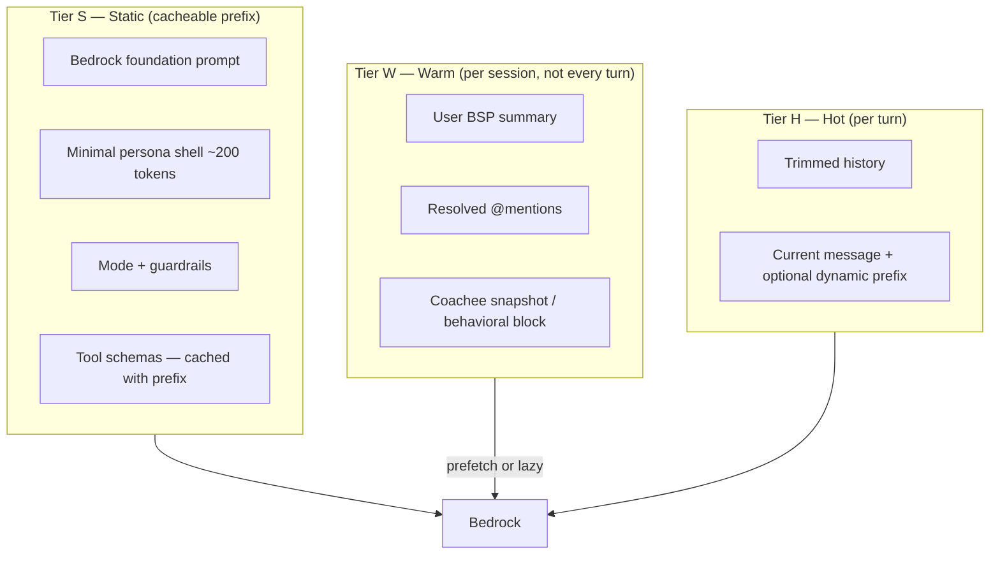
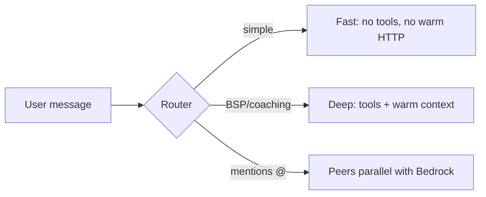
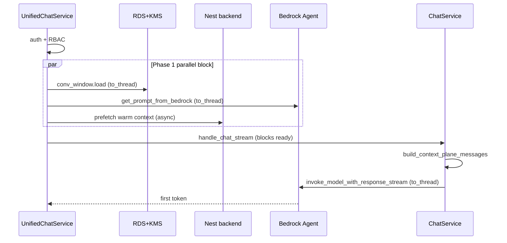

# Chatbot Context Plane & Latency Optimization

**Branch:** `fix/chatbot-optimization-I`  
**Status:** Design document — implementation follows this plan  
**Target:** Time-to-first-token (TTFT) ≤ 1–1.5s for employee quick chat (warm path)  
**Decision framework:** [`PYTHON314_RULES_V2.md`](../../PYTHON314_RULES_V2.md) (applicable rules cited per phase)

---

## 1. Problem statement

The unified chat pipeline (`POST /chat-stream` → `UnifiedChatService` → `ChatService` → Bedrock) stacks more context into a single monolithic system prompt on every turn. Recent features (user BSP personalization, peer @mentions) add HTTP and tokens to an already heavy critical path.

**Observed TTFT:** ~4–5s in ideal conditions; worse on cold Lambda or coach/deep-dive paths.

**Root cause is structural, not one feature:**

| Contributor | Typical TTFT impact | Notes |
|---|---|---|
| Lambda cold start + sync boto3/psycopg2 | 0–3+ s (spiky) | Blocks event loop |
| Large static system prompt (coach ~3.3k tokens in code) | 0.5–2+ s prefill | Recomputed every request |
| Sequential pre-Bedrock chain (DB → HTTP → prompt) | 200–800+ ms | Independent I/O awaited in series |
| Tool-first agentic turn (RAG, `get_client_snapshot`) | +1–3 s before answer | Second+ Bedrock calls |
| BSP / peer / user XML injection | +50–300 ms HTTP + ~100–900 tokens | Per-turn when always injected |
| No Bedrock `cache_control` / `cachePoint` | Missed 60–85% prefill savings | Full prefix re-prefilled |

Profile injection is **not** the main villain (coach persona + tools dominate token count), but **always appending** dynamic XML to the system prompt hurts cache stability and prefill.

---

## 2. Goals and non-goals

### Goals

1. **TTFT ≤ 1–1.5s** for employee `quick` chat on a warm Lambda with no tool loop.
2. **Measurable pipeline** — every step emits `event`, `status`, `duration_ms`, correlation IDs.
3. **Context Plane** — separate static, warm, and hot tiers instead of prompt stuffing.
4. **Graceful degradation** — missing warm context never blocks chat.
5. **Unified context resolution** — one service for user, peer, and coach BSP shapes.
6. **Align with Python 3.14 rulebook** where applicable to this workload.

### Non-goals (this initiative)

- Rewriting Bedrock foundation prompts (content ownership stays with prompt management).
- Changing RBAC or auth contract.
- Backend API redesign (Nest remains source of truth for personalization and peers).
- Sub-1.5s TTFT for coach + RAG + full agentic loop on every query (requires fast/deep path split).

---

## 3. Current orchestration (baseline)

### Entry path

```
POST /chat-stream
  → chat.py (Bearer token)
  → UnifiedChatService.handle_unified_chat_stream()
  → ChatService.handle_chat_stream()
  → BedrockClient.generate_chat_stream()
  → first text_delta → TokenEvent (SSE)
```

### Pre–first-token sequence (today)

| Step | Component | Sync/async | Cached? |
|---|---|---|---|
| Pydantic validation | `ChatRequest` | Sync | — |
| Auth + RBAC | `auth_context.py` | Sync | — |
| Thread create / load | `ThreadService` | **Sync DB** | No |
| Conversation window | `ConversationWindowService.load()` | **Sync DB + KMS** | No |
| Request validation | `ChatService._validate_request()` | Sync | — |
| Layer 1 foundation prompt | `get_prompt_from_bedrock()` | **Sync boto3** | `@lru_cache(1)` |
| User personalization | `BspContextInjector` → backend GET | Async HTTP | 15 min in-proc |
| Peer mentions | `PeerMentionContextInjector` → backend POST | Async HTTP | 15 min in-proc |
| Coach BSP | `get_behavioral_profile_block()` | Async | 15 min in-proc |
| Prompt assembly | `build_context_plane()` | Sync CPU | No |
| History trim | `trim_to_window()` | Sync | — |
| First Bedrock chat invoke | `generate_chat_stream()` | **Sync boto3** | No prompt cache |

**Already parallel:** user personalization + peer mentions via `asyncio.gather` in `_resolve_employee_context_blocks()`.

**Still sequential:** foundation prompt fetch, DB/KMS window load, and context HTTP are not overlapped.

### Prompt layers stuffed into one system string

1. Bedrock Layer 1 (foundation)
2. Mode (`quick` / `deep_dive`)
3. Persona spec — **coach alone ~13k chars (~3.3k tokens)** in `prompts.py`
4. Context-awareness block (`deep_dive`)
5. Coach `<behavioral_profile>` or Path B tool-first instruction
6. `<user_personalization>` (~100–400 tokens)
7. `<mentioned_peers>` (0–3 peers, ~300–900 tokens)
8. Tools JSON in request body (coach ~1k tokens)

Bedrock receives a **single system string** with **no `cache_control` breakpoints** — every turn recomputes prefill on the full prefix.

### Representative input token totals (first invocation)

| Persona / mode | Est. input tokens |
|---|---|
| default / quick, no thread | ~1,500–3,000 |
| employee / quick + personalization | ~2,000–3,500 |
| employee / deep_dive + peers | ~3,500–5,500 |
| coach / deep_dive + Path A snapshot | **8,000–15,000+** |
| coach / Path B (`client_id` only) | ~5,000–7,000 |

### Key files

| File | Role |
|---|---|
| `app/services/unified_chat_service.py` | Auth, thread, history, audit |
| `app/services/chat_service.py` | Validation, context, prompt, Bedrock loop |
| `app/domain/context_plane.py` | `build_context_plane()` |
| `app/infrastructure/bedrock_client.py` | Invoke + stream + cached foundation |
| `app/services/bsp_context_injector.py` | User + coach BSP blocks |
| `app/services/peer_mention_context_injector.py` | Peer @mention resolution |
| `app/infrastructure/backend_client.py` | Nest HTTP (personalization, peers) |
| `app/api/dependencies.py` | DI singletons |

---

## 4. Reimagined architecture: Context Plane

Stop treating the system prompt as the only context channel. Split into three tiers:



### Design principles

1. **Minimize prefill** — smaller + cached static prefix is the largest win.
2. **Parallelize independent I/O** — `TaskGroup` / `gather` on the critical path.
3. **Prefetch on session open** — warm tier loads when thread is created or chat UI mounts, not on send.
4. **Lazy context** — inject BSP only when the turn needs it (router or explicit `mentions`).
5. **Stable bytes for cache** — no date, user id, or profile XML in the cached prefix; dynamic parts **after** `cache_control` breakpoint.
6. **Measure three TTFTs** — first SSE byte, first post-tool token, first answer token.

### Conflict rule (BPT-636)

“Recent conversation > profile” → implement as a **user-message instruction**, not another system section.

---

## 5. Context Profile Service (unified warm tier)

Replace per-feature injectors in the hot path with one orchestration service. Existing formatters and backend contracts stay; wiring changes.

```
ContextProfileService
├── resolve_self(token)              → GET .../personalization-context
├── resolve_peers(token, ids)        → POST .../peer-mentions/resolve
├── resolve_coachee(token, client_id)→ coach BSP / snapshot
├── prefetch(session_key, scopes)    → warm tier on thread/session open
└── format_for_turn(bundle, strategy)→ where/how blocks enter the model
```

**Reuse:**

- `bsp_profile_formatters.py` — compact XML
- `BspContextInjector` / `PeerMentionContextInjector` — adapters behind `ContextProfileService` initially; consolidate in Phase 2

### Turn strategies (not always `system_append`)

| Strategy | When | TTFT impact |
|---|---|---|
| `none` | Greetings, generic BSP FAQ | Lowest |
| `user_message_prefix` | Employee quick default — 2–3 line style hint | Low; stable system cache |
| `tool_deferred` | “Tell me about my style” — model calls read-only tool | No upfront HTTP |
| `system_append` | Deep dive / coach session prep | Higher; use only when needed |

### Warm-tier policy

| Data | Tier | When it enters the model |
|---|---|---|
| Platform guardrails | S (cached system) | Always |
| Short persona behavior rules | S | Always |
| User BSP compact summary | W (Redis / in-proc, 15 min TTL) | Prefetch + inject if profile-relevant OR `user_message_prefix` |
| Peer @mentions | W | Only when `mentions` present; parallel with Bedrock |
| Coachee profile | W | Coach + `client_id`; prefer Path C over Path B tool-first |

---

## 6. PYTHON314_RULES_V2 mapping

Rules from the repo decision framework that **apply** to this chatbot optimization work:

| Rule | Requirement | How we apply it |
|---|---|---|
| **D-01** MUST Async-first | `TaskGroup` / `gather` for I/O | Parallel foundation prompt ∥ window load ∥ warm context |
| **D-02** MUST CPU/isolation | `asyncio.to_thread` for sync adapters | boto3 Bedrock invoke, psycopg2 DB, KMS off event loop |
| **D-03** MUST ContextVars | Request-scoped IDs | `request_id`, `trace_id`, `company_id` via `ContextVar` in orchestration |
| **D-05** MUST Protocol-first | Provider contracts | `BedrockChatProvider`, `ContextResolver` as `Protocol` |
| **D-06** MUST Data models | Boundaries | `Pydantic` for API; `dataclass(slots=True)` for hot internal bundles |
| **D-07** SHOULD Prompt IR |Inspectable templates | Template-IR for guardrail/masking; keep simple f-string assembly where static |
| **D-08** MUST Cache constructors | Singleton clients | Keep `@lru_cache` on clients, adapters, `TypeAdapter` — never cache request-private state |
| **D-09** MUST Dynamic lifecycles | `AsyncExitStack` | httpx clients, optional prefetch task cleanup |
| **D-12** MUST Telemetry | `event`, `status`, `duration_ms` | Per-step spans: `auth`, `thread_load`, `warm_context`, `prompt_build`, `bedrock_ttft` |
| **D-14** MUST Optimization order | Measure → cache → tokens → concurrency | Phase 0 instruments before micro-optimizations |
| **D-16** MUST Timeout budgets | Handler-level caps | Per-step timeouts; backend HTTP budget << 30s default |
| **D-17** SHOULD Call-graph forensics | Timeout triage | Capture async call graph on timeout paths (Python 3.14) |
| **D-18** MUST UUIDv7 | Sortable correlation | `uuid.uuid7()` for `request_id` / `trace_id` when generated in-process |
| **D-19** MUST Pydantic fast-path | Hot entrypoints | Cached `TypeAdapter` for `ChatRequest` parsing where repeated |
| **D-22** MUST Benchmark gate | Evidence before advanced runtime | Benchmark before interpreter pools / free-threading (not planned for v1) |
| **D-24** EXPERIMENT Eager tasks | Cache-hit paths | Evaluate only after warm-tier prefetch shows high hit rate |

**Explicitly out of scope for v1:**

- **D-13** Interpreter pools — I/O-heavy pipeline uses `TaskGroup` only
- **D-15** Free-threading — no-GIL not required
- **D-20–D-21** Step Functions — chat is synchronous Lambda path today
- **D-04** `from __future__ import annotations` — follow existing file policy; no mass reformat

---

## 7. Phased implementation plan

### Phase 0 — Instrumentation (1–2 days)

**Objective:** Baseline metrics before behavior changes. **D-14, D-12, D-16, D-18.**

| Deliverable | Detail |
|---|---|
| Step timer middleware | Wrap each pipeline step; emit structured log: `event`, `status`, `duration_ms`, `request_id`, `trace_id` |
| TTFT metrics | `ttft_sse_ms`, `ttft_first_token_ms`, `ttft_post_tool_ms`, `ttft_answer_ms` |
| Token metrics | `system_prompt_tokens`, `tools_tokens`, `cache_read_tokens` (placeholder until Phase 2) |
| Dashboard / query | CloudWatch Logs Insights or existing observability sink |

**Spans to add:**

```
auth → rbac → thread_load → conv_window → foundation_prompt → warm_context → prompt_build → bedrock_invoke → first_token
```

**Success criteria:** P50/P95 TTFT per persona/mode visible for 1 week of staging traffic.

---

### Phase 1 — Quick wins (~500–1500 ms employee path)

**Objective:** Parallelism + prefetch + non-blocking sync I/O. **D-01, D-02, D-08, D-09.**

| # | Change | Files (indicative) | Expected gain |
|---|---|---|---|
| 1.1 | `asyncio.gather(foundation_prompt, conv_window, warm_context)` | `unified_chat_service.py`, `chat_service.py` | 100–400 ms |
| 1.2 | `asyncio.to_thread` for boto3 + psycopg2 + KMS | `bedrock_client.py`, `conversation_window.py`, `thread_service.py` | Event loop throughput; tail latency |
| 1.3 | **Prefetch** warm context on `thread_created` / session open endpoint | New `prefetch` on `ContextProfileService`; optional `POST /threads/{id}/warm-context` | Removes HTTP from send path on cache hit |
| 1.4 | Employee quick default → `user_message_prefix` strategy | `chat_service.py`, `prompts.py` | Stable system bytes; smaller prefill |
| 1.5 | Tighten backend HTTP timeout budget (e.g. 2–3s with degrade) | `backend_client.py` | Fail fast; **D-16** |
| 1.6 | Ops: provisioned concurrency (1–2 warm Lambdas) | CDK `runtime_stack.py` | Cold start → near zero |

**Tests:**

- Unit: parallel gather ordering and degrade-on-timeout
- Integration: TTFT regression harness (mock Bedrock stream)

**Success criteria (warm Lambda, employee quick):** P50 TTFT ≤ 2.5s (interim); P95 ≤ 4s.

---

### Phase 2 — Prompt architecture & Bedrock caching (~1–2 s prefill reduction)

**Objective:** Cacheable static prefix; slim runtime persona. **D-07, D-08.**

| # | Change | Detail |
|---|---|---|
| 2.1 | Move coach `PERSONA_SPECS` bulk to Bedrock Prompt Management | Versioned, static, cacheable |
| 2.2 | Code retains ~150 token persona shell only | “Coach mode; full spec in cached prefix” |
| 2.3 | Enable Bedrock `cache_control` / `cachePoint` on static blocks | After foundation + tools; dynamic blocks after breakpoint |
| 2.4 | Move **date** to first user message, not system | Preserves byte-stable cache hash |
| 2.5 | Introduce `ContextProfileService` | Unify injectors; strategy selection per turn |
| 2.6 | Consolidate legacy prompt builder → `build_context_plane()` | Done |

**Success criteria:** `cache_read_tokens` > 0 on turn 2+; coach system tokens −60% on code path.

---

### Phase 3 — Routing & speculation (reliable sub-1.5s employee)

**Objective:** Fast vs deep path split. **D-01, D-22, D-24 (gated).**



| Path | Behavior | TTFT target |
|---|---|---|
| **Fast** | Cached prefix only, no tools, no profile HTTP | **< 1.5s** |
| **Deep** | Full agentic loop | 2–4s; show thinking stream immediately |
| **Speculative prefetch** | Start warm HTTP + embed when router confidence high; cancel if unused | Overlap with first Bedrock call |

**Router v1:** Heuristic (keyword + `mentions` + `chat_mode` + persona) — no extra model call.  
**Router v2 (optional):** Small classifier model behind **D-22** benchmark gate.

---

### Phase 4 — Multi-turn KV locality (long threads)

**Objective:** Reduce re-prefill cost on turn 2+.

- Aggressive quick-mode history cap (already `trim_to_window`; enforce summary + 6 msgs default).
- Evaluate Bedrock multi-turn cache hit rates post Phase 2.
- Long-term: append-prefill / disaggregated prefill patterns — **research only** until provider support is clear.

---

## 8. Anti-patterns to stop

| Anti-pattern | Why it hurts | Replacement |
|---|---|---|
| New XML block in system prompt per feature | Grows prefill; breaks cache | Warm tier + strategy |
| Coach Path B when Path C injector exists | Extra tool round-trip | Path C default |
| 13k-token persona concatenated at runtime | 3k+ tokens every request | Bedrock Prompt Management |
| Sync boto3 inside `async def` | Blocks concurrent streams | `asyncio.to_thread` |
| Sequential `await` for independent fetches | Linear latency sum | `TaskGroup` / `gather` |
| First stream token = “answer” when `tool_use` follows | Misleading FTT metrics | Three TTFT metrics |
| 30s backend timeout on critical path | Hides failures; blocks TTFT | 2–3s budget + degrade |

---

## 9. Realistic TTFT targets

| Path | Today (~) | After Phase 1 | After Phase 2 | After Phase 3 |
|---|---|---|---|---|
| Employee quick (warm Lambda) | 4–5 s | 1.5–2.5 s | 1.2–2.0 s | **0.8–1.5 s** |
| Employee + profile always in system | 4–5 s | 2–3 s | 1.5–2.5 s | 1–2 s |
| Coach + tools + RAG | 5–8+ s | 3–5 s | 2.5–4 s | 2–4 s (fast/deep split) |

Coach + RAG at 1.5s for **every** query is not realistic without dropping tools or accepting preamble/thinking tokens first.

---

## 10. Implementation checklist (execution order)

Use this as the PR sequence after this document is approved.

- [ ] **Phase 0:** `PipelineTimer` + structured telemetry (**D-12, D-18**)
- [ ] **Phase 0:** TTFT fields in `unified_chat_service` audit / interaction logs
- [ ] **Phase 1:** Parallel `gather` for foundation + window + warm context (**D-01**)
- [ ] **Phase 1:** `asyncio.to_thread` wrappers for boto3 and DB (**D-02**)
- [ ] **Phase 1:** Warm-context prefetch on thread create (**D-08** — cache warm tier, not request state)
- [ ] **Phase 1:** `user_message_prefix` default for employee quick
- [ ] **Phase 1:** Backend HTTP timeout budget + degrade (**D-16**)
- [x] **Phase 2:** `ContextProfileService` + turn strategies
- [x] **Phase 2:** Bedrock `cache_control` on static prefix (`ENABLE_BEDROCK_PROMPT_CACHING`)
- [x] **Phase 2:** Slim coach persona shell in code (`COACH_PERSONA_SHELL`, optional `BEDROCK_COACH_PROMPT_ID`)
- [x] **Phase 2:** Date moved to user message (`build_context_plane`)
- [x] **Phase 3:** Fast/deep router (heuristic v1, `route_query`)
- [x] **Phase 3:** Speculative prefetch behind feature flag (`ENABLE_SPECULATIVE_WARM_PREFETCH`)
- [ ] **All phases:** Tests in `chatbot/src/tests/` mirroring domain structure
- [ ] **D-22:** Publish benchmark record before any interpreter pool / eager-task adoption

---

## 11. Open questions

1. **Prefetch trigger:** thread create only, or also first `GET /threads/{id}` from frontend?
2. **Redis vs in-proc:** Is 15 min in-proc cache sufficient on provisioned concurrency, or do we need ElastiCache for cross-instance warm tier?
3. **Bedrock prompt caching:** Confirm model + region support for `cachePoint` on Claude Sonnet 4.5 in our account.
4. **Router ownership:** Heuristic in chatbot vs lightweight classifier Lambda.
5. **Metric sink:** Extend existing audit log vs dedicated performance table.

---

## 12. References

- [AWS Bedrock prompt caching](https://docs.aws.amazon.com/bedrock/latest/userguide/prompt-caching.html)
- [PYTHON314_RULES_V2.md](../../PYTHON314_RULES_V2.md) — repository decision framework
- Internal: `chatbot/docs/audit_architecture.md` — audit layers (extend with performance events)
- Prior features: BPT-636 (user personalization), peer @mentions (BPT-634)

---

## 13. Phase 0 vs existing audit logging

The chatbot already has a **compliance audit system** (`app/services/audit/`). Phase 0 **does not replace or extend** that RDS schema. The two layers serve different purposes:

| Dimension | Audit log (existing) | Pipeline telemetry (Phase 0) |
|---|---|---|
| **Purpose** | Compliance, cost, outcome accountability | Performance engineering, TTFT diagnosis |
| **Granularity** | **One row per interaction** | **Many events per interaction** (auth, prepare_context, bedrock_ttft, …) |
| **Storage** | RDS `chatbot_audit_logs` + CloudWatch `audit_log` | **CloudWatch only** (`pipeline_step`, `pipeline_summary`) |
| **Schema** | Fixed Pydantic `AuditLogEntry` (outcome, tokens, tool_calls_count) | Flexible step array + TTFT fields |
| **Latency metric** | Single `latency_ms` = **end-to-end** (includes follow-up suggestions, persist) | `ttft_first_token_ms`, `ttft_sse_ms`, per-step `duration_ms` |
| **PII guardrail** | Yes — `assert_no_sensitive_content` before RDS write | No user message content; IDs + timings only |
| **When written** | `finally` block once per request | Each step on completion + summary in `finally` |
| **Ad-hoc logs today** | Partial overlap: `user_personalization_context`, `peer_mentions_resolution`, `follow_up_suggestion_telemetry` | Replaces ad-hoc timing with **standard D-12 contract** |

**What Phase 0 adds that audit does not:**

1. **Sub-step timing** before first Bedrock token (auth, rbac, thread_setup, prepare_context, prompt_build, bedrock_ttft).
2. **TTFT metrics** distinct from total request latency.
3. **`context_strategy`** and **`warm_cache_hit`** on the performance summary.
4. **`request_id` / `trace_id`** correlation (ContextVar, D-03/D-18) separate from Bedrock `correlation_id`.

**What stays in audit only:** outcome, denial_reason, error_code, retrieved_source_ids, RBAC role, session_id — the fields required by `audit_log_access_contract.md`.

Implementation: `app/observability/pipeline_telemetry.py` writes to CloudWatch; `emit_pipeline_telemetry()` runs in the same `finally` as `write_audit_log()` but does not touch RDS.

---

## Appendix A — Proposed telemetry event shape

```json
{
  "event": "bedrock_ttft",
  "status": "ok",
  "duration_ms": 842,
  "request_id": "0194a1b2-...",
  "trace_id": "0194a1b2-...",
  "company_id": "sha256:...",
  "session_id": "uuid",
  "thread_id": "uuid",
  "persona": "employee",
  "chat_mode": "quick",
  "context_strategy": "user_message_prefix",
  "system_prompt_tokens": 2100,
  "tools_tokens": 420,
  "cache_read_tokens": 0,
  "warm_cache_hit": true,
  "degraded": false
}
```

On timeout (**D-16, D-17**):

```json
{
  "event": "warm_context",
  "status": "timeout",
  "duration_ms": 3000,
  "timeout_ms": 3000,
  "error_type": "UpstreamTimeoutError",
  "call_graph_snapshot": "..."
}
```

---

## Appendix B — Parallel critical path (Phase 1 target)


