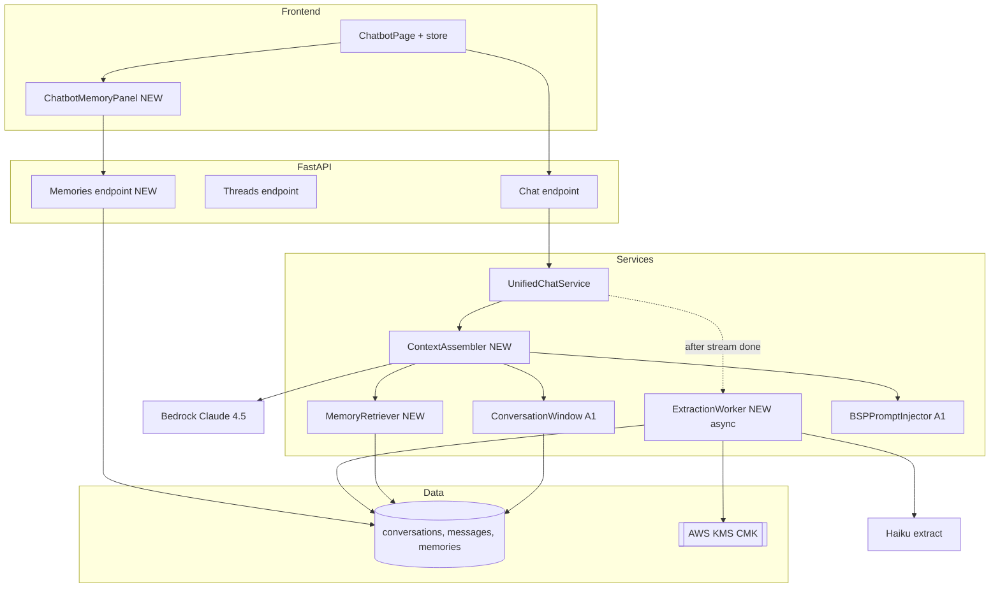

# Approach 3 — "Distilled Memories" (Mem0-inspired middle ground)

> **Part of the chatbot memory pitch deck.** See [`00-executive-summary.md`](./00-executive-summary.md) for context and comparison against the other three approaches.

---

## 1. TL;DR

**Two sentences, no jargon.** We save every conversation, and after the user stops talking we run a tiny background job that reads what was said and extracts the handful of **facts worth remembering** (preferences, context, named people, BSP-relevant observations) into a per-user memory bank. Next time the user chats, the bot looks up the 5–10 most relevant memories and weaves them into its reply — so it feels like the bot actually *knows* them without us having to build a full behavioral knowledge graph.

**Analogy for non-technical folks.** Imagine a coach who, after every session, spends three minutes writing **index cards**: "Sam prefers bullet answers," "Sam is working on delegating to her team of 4," "Sam feels most alert in the morning." Before the next session the coach flips through the deck and pulls out the half-dozen cards most relevant to what Sam wants to talk about today. That's it — no fancy graph, no progression charts, just a growing stack of well-curated cards per user.

---

## 2. What the user experiences

- **End user / coach / super-admin:** thread sidebar (same as A1/A2), **plus** the bot naturally remembers personal facts across threads. If the user said "I'm a PM at Acme, I have two reports — Priya and Raj" in thread A three weeks ago, thread B references them by name.
- **Coach mode:** extracted observations are tagged with BSP dimensions (strengths_observed, stress_triggers_observed, etc.), so when a coach asks "what patterns have we seen?" the bot can surface them.
- **"What Bispy Bot remembers about you" panel** (`ChatbotMemoryPanel`): the user sees every memory as a row — the fact, when it was learned, which conversation it came from, and a **delete** button. A trust-building transparency feature.
- **The bot does NOT:** track growth edges over time, generate insight notes from reflection cycles, or show a developmental timeline. Those are A4 features.

---

## 3. Technical architecture

### The napkin drawing

```
  ┌──────────────┐
  │  Frontend    │ ─────▶ ChatService
  └──────────────┘              │
                                ▼
  ┌─────────────────────────────────────────────────────────┐
  │  PROMPT BUILD  (before each LLM call)                   │
  │   1. pull BSP profile (cached)                          │
  │   2. pull last N turns + rolling summary (A1 tier)      │
  │   3. retrieve top-k memories for this user (new)        │
  │   4. assemble and call Claude                           │
  └─────────────────────────────────────────────────────────┘

  AFTER RESPONSE (async, non-blocking):
  ┌─────────────────────────────────────────────────────────┐
  │  ExtractionWorker  (Haiku + JSON)                       │
  │   "Read this turn. Output 0–3 memories to save."        │
  │                                                          │
  │   Output schema:                                         │
  │   [ { kind, text, bsp_dimension?, entities[] }, ... ]   │
  └──────────────────────┬──────────────────────────────────┘
                          ▼
            ┌───────────────────────────────┐
            │  memories table (per-user)    │
            │   • pgvector embedding        │
            │   • bsp_dimension tag         │
            │   • source_message_id         │
            └───────────────────────────────┘
```

### Mermaid



### Patterns, named

- **Extraction**: Mem0's **single-pass hierarchical extraction** — one structured Haiku call per turn (or per N turns) with JSON-mode output. Mem0 reports 91.6 LLM-Judge on LOCOMO at ~6,950 tokens/retrieval versus 25K+ for full-context; we adopt the pattern, not the hosted service.
- **Storage**: PostgreSQL + **pgvector** (already deployed). A separate `memories` table from the existing `document_chunks` — different embedding, different access controls.
- **Retrieval**: **hybrid multi-signal** — semantic cosine + entity match + optional tag filter — fused with Reciprocal Rank Fusion (`k=60`). No graph PageRank. No LLM rerank (unless `deep_dive`).
- **BSP conditioning**: static `<behavioral_profile>` block in the system prompt (A1-style), refreshed on assessment retake. BSP tags (`strengths_observed` / `stress_triggers_observed` / `growth_edges_observed`) are captured on each memory but **not analytically tracked over time** — that's A4.

### Mode × memory policy (resolves the `quick`-vs-`deep_dive` inconsistency)

| Policy | `quick` | `deep_dive` |
|---|---|---|
| Verbatim window | last 0 turns | last 6 turns |
| Rolling summary | skip | include |
| Memory retrieve | top 2 (preferences only, tag-filtered) | top 8 |
| BSP profile inject | always | always |
| Extraction on turn close | **no** (quick is stateless) | yes |
| LLM rerank | no | optional (Haiku) |

---

## 4. Data-model additions

Migration `003_distilled_memories.sql` (supersedes A1's `003_thread_persistence.sql` — it includes everything A1 has plus the memory layer).

```
-- A1 tables: conversations, messages, thread_summaries (see approach-01)

memories (
  id                  UUID PK,
  user_id_hash        TEXT NOT NULL,
  kind                TEXT NOT NULL,          -- preference | fact | observation | relationship | skill
  bsp_dimension       TEXT NULL,              -- strengths_observed | stress_triggers_observed
                                              -- | growth_edges_observed | environmental_preferences
                                              -- | interaction_preferences | NULL (non-BSP)
  content_ciphertext  BYTEA NOT NULL,         -- AES-256-GCM under per-user DEK
  embedding           VECTOR(1024) NOT NULL,  -- Titan v2
  entities            JSONB NOT NULL DEFAULT '[]'::jsonb,
  importance          REAL NOT NULL DEFAULT 0.5,  -- Haiku-scored 0..1
  source_message_id   UUID NULL REFERENCES messages(id) ON DELETE SET NULL,
  source_conversation_id UUID NULL REFERENCES conversations(id) ON DELETE SET NULL,
  superseded_by       UUID NULL REFERENCES memories(id),
  dek_id              UUID NOT NULL REFERENCES users_kms(user_id_hash),
  created_at          TIMESTAMPTZ NOT NULL DEFAULT now(),
  last_accessed_at    TIMESTAMPTZ NULL,
  user_edited         BOOLEAN NOT NULL DEFAULT false,
  soft_deleted_at     TIMESTAMPTZ NULL
)

users_kms (
  user_id_hash           TEXT PK,
  kms_key_arn            TEXT NOT NULL,
  encrypted_dek          BYTEA NOT NULL,
  created_at             TIMESTAMPTZ NOT NULL DEFAULT now(),
  scheduled_deletion_at  TIMESTAMPTZ NULL
)

consent_ledger (
  id            UUID PK,
  user_id_hash  TEXT NOT NULL,
  scope         TEXT NOT NULL,      -- e.g. 'memory_extraction', 'coach_access'
  granted       BOOLEAN NOT NULL,
  source        TEXT NOT NULL,      -- ui | tos | api
  granted_at    TIMESTAMPTZ NOT NULL DEFAULT now(),
  revoked_at    TIMESTAMPTZ NULL,
  evidence_hash TEXT NOT NULL
)

erasure_requests (
  id                     UUID PK,
  user_id_hash           TEXT NOT NULL,
  requested_at           TIMESTAMPTZ NOT NULL DEFAULT now(),
  completed_at           TIMESTAMPTZ NULL,
  method                 TEXT NOT NULL,      -- cryptoshred | hard_delete
  dek_deletion_scheduled_at TIMESTAMPTZ NULL,
  export_presigned_url   TEXT NULL,
  export_expiry_at       TIMESTAMPTZ NULL
)
```

Indexes:

- `CREATE INDEX memories_embedding_hnsw ON memories USING hnsw (embedding vector_cosine_ops);`
- `CREATE INDEX memories_user_kind ON memories(user_id_hash, kind) WHERE soft_deleted_at IS NULL;`
- `CREATE INDEX memories_entities_gin ON memories USING gin(entities);`
- `CREATE INDEX memories_bsp ON memories(user_id_hash, bsp_dimension) WHERE bsp_dimension IS NOT NULL;`

**Crypto-shredding** arrives in A3 (not in A1). Per-user DEK in `users_kms`; `memories.content_ciphertext` and `messages.content` are envelope-encrypted. Erasure = `ScheduleKeyDeletion` on the DEK + soft-delete rows + background reclaim. O(1) erasure complexity.

---

## 5. Frontend changes

Everything A1 has, **plus**:

- `frontend/src/components/chatbot/ChatbotMemoryPanel.tsx` — **new**: lists `memories` (kind, content, source, created_at), delete button, "edit" for user correction, consent toggle at the top ("Allow Bispy Bot to remember things about me"). Referenced from the top bar.
- `frontend/src/store/chatbot.store.ts` — **extend**: memories slice; optimistic delete / edit.
- `frontend/src/api/chatbot.api.ts` — add `listMemories`, `deleteMemory`, `editMemory`, `getConsent`, `setConsent`.
- `frontend/src/const/chatbot.const.ts` — strings for the panel + consent.
- `frontend/src/types/chatbot/chatbot.types.ts` — `ChatbotMemory`, `MemoryKind`, `BspDimension`.
- Optional polish: a small **"memory" chip under assistant messages** that shows "referenced 2 memories" with a click-through to the panel — transparency dividend.

---

## 6. Backend changes

Everything A1 has, **plus** the memory layer:

- `chatbot/src/lambdas/db_init/migrations/003_distilled_memories.sql` — A1 tables + memory tables.
- `chatbot/src/app/infrastructure/crypto.py` — **new**: per-user DEK envelope encryption via AWS KMS.
- `chatbot/src/app/repositories/memory_repository.py` — **new**: CRUD for `memories`; hybrid retrieval (semantic + entity) with RRF.
- `chatbot/src/app/repositories/user_key_repository.py` — **new**: DEK issuance, fetch, schedule deletion.
- `chatbot/src/app/services/memory/extraction_worker.py` — **new**: Haiku-based extraction with structured JSON output. Invoked asynchronously from `UnifiedChatService` after the stream `done` event.
- `chatbot/src/app/services/memory/retriever.py` — **new**: query → semantic pass + entity pass → RRF fusion → top-k budgeted selection.
- `chatbot/src/app/services/memory/context_assembler.py` — **new**: replaces the straight-line prompt build in `chat_service.py` with Anthropic's four context ops (Write / Select / Compress / Isolate). Injects BSP block, memory citations, conversation window, rolling summary.
- `chatbot/src/app/api/routes/memories.py` — **new**: `GET /memories`, `DELETE /memories/{id}`, `PATCH /memories/{id}`, `POST /memories` (manual "remember this").
- `chatbot/src/app/api/routes/privacy.py` — **new**: `POST /privacy/erasure`, `GET /privacy/export`.
- `chatbot/src/app/api/routes/consent.py` — **new**: `GET /consent`, `POST /consent`.
- `chatbot/src/app/services/unified_chat_service.py` — **modify**: invoke `extraction_worker` after stream completes; pass `thread_id`.
- `chatbot/src/app/services/chat_service.py` — **modify**: use `ContextAssembler` instead of inline prompt build.
- `chatbot/src/app/domain/prompts.py` — **modify**: add an `<extracted_memories>` slot + `<behavioral_profile>` slot in `build_combined_prompt`; wire into `ContextAssembler`.
- `chatbot/src/app/models/schema.py` — `ChatRequest` gets `thread_id`; `ChatResponse` carries optional `memory_citations: list[MemoryCitationRef]`.

### Extraction worker prompt sketch (designed to keep Haiku fast)

```
SYSTEM: Extract 0–3 memories from this turn. Output strict JSON only.
Schema:
  { "memories": [
      { "kind": "preference|fact|observation|relationship|skill",
        "text": "third-person statement about the user",
        "bsp_dimension": "strengths_observed|stress_triggers_observed|
                         growth_edges_observed|environmental_preferences|
                         interaction_preferences|null",
        "entities": ["Priya", "Acme"],
        "importance": 0.0..1.0 } ] }
Rules:
  - Only extract NEW information not already in <existing_memories>.
  - Never infer clinical / medical / protected-class attributes.
  - Use BSP methodology terminology for bsp_dimension; use null if non-BSP.
  - Skip meta chit-chat ("thanks", "ok").
```

~150 tokens of prompt + turn content. Output typically <300 tokens. Runs <200 ms on Haiku.

---

## 7. Infrastructure / DevOps footprint

| Concern | Change |
|---|---|
| RDS | New tables on existing instance; pgvector HNSW + GIN indexes. |
| KMS | One **customer-managed CMK** (`bmm-user-deks-cmk`); per-user DEKs generated via `GenerateDataKey` and stored in `users_kms`. AWS-managed key rotation annual. |
| Lambda | Extraction worker runs in the chat Lambda initially (post-`done` event, non-blocking) — no new Lambda. Promote to its own Lambda behind SQS if contention appears (budgeted as future work). |
| CDK | `chatbot/infrastructure/modules/kms_user_deks.py` + IAM policy additions. |
| CI | New tests: `test_extraction_worker.py`, `test_retriever.py`, `test_crypto_shred.py`. |
| Observability | CloudWatch EMF: `memories.created`, `memories.retrieved`, `extraction.latency_ms`, `extraction.errors`, `dek.generated`, `dek.deleted`. |
| Rollback | Revert migration; keep thread tables; memories become dead rows (schedule cleanup). |

---

## 8. Solo-developer effort estimate

**Total: 4–6 weeks** (~25 working days). Includes the A1 foundation (not on top of A1).

| Phase | Days | Contents |
|---|---|---|
| 1. A1 foundation: migrations, repos, threads API, sidebar | 6 | Re-use A1 plan §8 phases 1–7 |
| 2. Crypto wrapper + per-user DEK issuance | 2 | `crypto.py`, `user_key_repository`, CDK KMS module, erasure workflow |
| 3. Memories schema + repository | 2 | DDL, CRUD, hybrid retrieval (RRF) |
| 4. Extraction worker | 2 | Haiku prompt, JSON parsing, error handling, async invocation |
| 5. Retriever + context assembler | 3 | Semantic + entity + RRF + budget selection; replace inline prompt build |
| 6. Consent + privacy endpoints | 2 | Consent ledger, `/privacy/erasure`, `/privacy/export` |
| 7. Memories API + Memory Panel UI | 3 | `/memories` + panel (list/delete/edit/manual-add), consent toggle UI |
| 8. Wire-up + mode policy | 1 | quick vs deep_dive retrieval policy |
| 9. Internal eval harness (smoke benchmark) | 1 | Small LOCOMO-style golden set, 20–30 cases, LLM-judge |
| 10. Docs + runbooks + buffer | 3 | Compliance doc, runbook, manual QA, 10% contingency |

---

## 9. Runtime cost model (per 1,000 monthly active users)

Assumptions: 10 conversations/MAU/mo, 12 turns/conversation, ~25% of assistant turns trigger memory extraction (the rest produce no extractable facts), 10% of all turns trigger retrieval.

| Line item | Rate | Volume | Cost |
|---|---|---|---|
| RDS storage delta | ~$0.10/GB-mo gp3 | ~100 MB (120K messages + ~30K memories + embeddings) | ~**$0.01** |
| KMS requests | $0.03 / 10K | ~500K (encrypt + decrypt + DEK ops) | ~**$1.50** |
| Bedrock Haiku — extraction | $0.80/M in, $4/M out | 30K calls × ~400 in + ~300 out | ~**$50** |
| Bedrock Haiku — summary (A1 layer) | $0.80/M in, $4/M out | 12K refreshes × ~500 in + ~150 out | ~**$12** |
| Bedrock Titan v2 embeddings | $0.00002/1K tokens | 30K memories × ~50 tokens | ~**$0.03** |
| Retrieval vector-search compute | on existing RDS | | $0 |
| Bedrock Sonnet chat (unchanged) | baseline | | — |

**Net delta: ~$64/mo per 1K MAU** (about **6¢ per MAU per month**). Dominated by Haiku extraction — if cost matters, reduce extraction frequency (every 3 turns instead of every turn, or only on session close).

---

## 10. Latency profile

| Stage | Baseline | A3 | Delta |
|---|---|---|---|
| First-token TTFB (p50) | ~750 ms | ~800 ms | +50 ms (hybrid retrieve: ~20 ms + one extra KMS decrypt batch ~30 ms) |
| First-token TTFB (p95) | ~1,300 ms | ~1,400 ms | +100 ms |
| Extraction (async, post-stream) | — | ~150–500 ms | off the critical path |
| Memory panel load | — | <150 ms | indexed query |

pgvector HNSW over ~30K user memories returns in <10 ms; entity GIN match is <5 ms; RRF fusion is O(k). The added cost is dominated by batch-decrypt of the top-k records.

---

## 11. Compliance posture

A3 is the **sweet spot for compliance** because we own the storage and we have per-user crypto-shredding, yet we have not yet built the full graph / reflection apparatus that triggers heavier DPIA scrutiny in A4.

- **GDPR**:
  - Art. 5 (minimization) — only extracted, structured memories; we do not log raw transcripts beyond `messages` table (encrypted + user-deletable).
  - Art. 13–15 (transparency / access) — Memory Panel shows every stored memory + source.
  - Art. 16 (rectification) — `PATCH /memories/{id}` lets the user correct a misremembered fact.
  - Art. 17 (erasure) — crypto-shred via DEK destruction: **O(1)**, user-initiated, 7-day cancel window.
  - Art. 20 (portability) — `GET /privacy/export` returns full JSON (conversations, messages, memories) via signed S3 URL.
  - Art. 22 (automated decisions) — A3 does not make decisions *about* users; it recalls facts *with* users. Stay on this side of the line.
  - Art. 25 / 32 (privacy-by-design / security) — envelope encryption default-on.
  - Art. 35 (DPIA) — triggered by behavioral profiling → ship the DPIA alongside A3.
- **EU AI Act (2025 prohibitions already in force; 2026-08 high-risk)** — stay out of high-risk by design: no automated adverse decisions, no emotion inference in workplace, no social scoring. Document.
- **CPRA / VCDPA / CPA / CTDPA / UCPA / Colorado AI Act** — access + delete + correct + opt-out rights satisfied by Memory Panel + `/privacy` endpoints.
- **Quebec Law 25 / PIPEDA** — consent ledger + access/delete endpoints + breach notification process.
- **HIPAA** — not applicable; A3 inherits `prompts.py` non-clinical guardrails and adds a classifier in the extraction worker that rejects medical/PHI extractions.

**What has to ship alongside A3:**
1. ToS update + **explicit opt-in for memory extraction** (default off for EU/CA, on-with-banner for US per your recommendation or global off — your call).
2. Memory Panel + consent UI (core of the A3 pitch).
3. `/privacy/erasure`, `/privacy/export`, `/consent` endpoints.
4. DPIA document under `chatbot/docs/compliance/a3-dpia.md`.
5. Guardrail update: extend `content_guardrail.py` to block extractions that match medical / protected-class patterns.

---

## 12. Pros / cons

**Pros**
- Cross-session personalization shipped in **4–6 weeks**.
- Best **effort-to-impact ratio** of the four approaches.
- Clean upgrade path to A4 — nothing is thrown away.
- Own the full stack: no vendor lock-in beyond AWS itself.
- Crypto-shred erasure (privacy best practice) lands here.
- Transparency panel builds user trust and satisfies multiple legal regimes at once.
- Uses only services already deployed (RDS, pgvector, Bedrock, KMS).

**Cons**
- No developmental trajectory tracking (growth edges, drift). A coach still has to synthesize progress manually.
- No reflection / insight synthesis — memories are facts, not insights.
- No bi-temporal supersession: if a memory becomes stale (user changes job), you must catch it in extraction or rely on the `superseded_by` column being set by a heuristic.
- Extraction quality depends on Haiku prompt engineering — iterate in Phase 9's eval harness.

---

## 13. Risk register

| ID | Risk | Likelihood | Severity | Mitigation | Class |
|---|---|---|---|---|---|
| R1 | Extraction hallucinates false memories | Medium | High | JSON-mode strict schema; user-editable; Memory Panel makes them visible; periodic LLM-judge audit | Standard |
| R2 | Memory drift / staleness (user changes job, bot still says old) | Medium | Medium | Extraction prompt looks at existing memories; if contradicted, set `superseded_by`; user can correct | Standard |
| R3 | Cost growth from Haiku extraction at scale | Medium | Medium | Extract per session-close instead of per-turn; reduce frequency; sample | Standard |
| R4 | User forgets they opted in and is surprised by specific recall | Medium | Medium | Inline "referenced 2 memories" chip under assistant messages + Memory Panel discoverable from top bar | Standard |
| R5 | PII / sensitive category leaks into memories | Medium | High | Guardrail classifier in extraction worker; explicit block-list; periodic audit job | Standard |
| R6 | Retrieval pulls irrelevant memories that pollute context | Medium | Medium | RRF + importance weighting; top-k cap; `deep_dive`-only LLM rerank | Standard |
| R7 | Crypto-shred edge case leaves searchable embeddings | Low | Medium | Sweep job deletes orphan rows after DEK destruction; integration test `test_crypto_shred.py` | Standard |
| R8 | pgvector HNSW performance degrades past ~100K memories per user | Low | Low | Per-user partitioning or prune-on-importance; not a near-term concern | Standard |

No High-Risk / High-Reward items in A3. By design — the point of A3 is **proven patterns only** (Mem0, RAPTOR, Anthropic context editing). A4 is where the experimental items live.

---

## 14. When to pick this

Pick **A3** if **any** of these are true:

- You want the chatbot to feel **noticeably personalized across sessions** within two months.
- You want to own the data and keep vendor lock-in low.
- You want a **clean path to A4** later without throwing work away.
- Compliance rigor matters (crypto-shred, transparency panel, per-user erasure).
- You are the **solo implementer** and need a plan that fits in one focused month-plus of engineering.

This is my personal recommendation for "ship first, upgrade later" — see [`00-executive-summary.md`](./00-executive-summary.md) for the full rationale and dissent cases.

Do **not** pick A3 if:
- The product thesis **requires** developmental-progression UI (growth timeline, dissonance detection) at launch — go straight to A4.
- You need the feature shipped in **one sprint** — use A1.
- You want **zero custom extraction pipeline** and are OK with vendor lock-in — use A2.

---

## 15. Migration / upgrade path

**A3 → A4 (BMM)**: **this is the easiest upgrade path of any approach**. Concretely:

1. **Add BMM's `memory_nodes`** table (superset of A3's `memories`). Existing rows are migrated with a single `INSERT ... SELECT`:

   ```sql
   INSERT INTO memory_nodes
     (id, user_id_hash, tier, kind, body_ciphertext, embedding, entities,
      importance, source_conversation_id, tx_time, dek_id, ...)
   SELECT id, user_id_hash, 'semantic', kind, content_ciphertext, embedding,
          entities, importance, source_conversation_id, created_at, dek_id, ...
   FROM memories;
   ```
2. **Add `memory_edges`** table for the bi-temporal graph. Initially empty; reflection agent populates it.
3. **Add `bpm_snapshots` + `bpm_signals`** tables; BPM service fetches from Assessment API.
4. **Add the reflection agent Lambda** + EventBridge triggers.
5. **Add `personalized PageRank`** to the retriever (feature-flagged).
6. **Add the Growth Panel UI** and the `<behavioral_state>` dynamic block in `ContextAssembler`.

Nothing from A3 is rewritten. The `MemoryRetriever`, `ContextAssembler`, `ExtractionWorker`, encryption layer, consent UI, Memory Panel, Threads API, and sidebar all remain.

**A3 → A2**: pointless; A2 has fewer features than A3.
**A3 → A1**: degrade by disabling extraction + retrieval; tables stay.

---

## 16. The 30-second elevator pitch

> "Distilled Memories is the 'smart default' for a behavioral platform. We save every conversation, run a tiny background job after each session that extracts the five-or-so facts worth remembering (tagged by BSP dimension), and next time the user chats we pull the most relevant ones into the prompt. Ships in four to six weeks solo, costs about six cents per user per month, and every line of code becomes the foundation for Approach 4 if we want to add the full developmental-growth tracking later. Users get a chatbot that feels like it knows them without us building a full knowledge graph. This is my recommended starting point if we want production impact fast with a real path to the advanced system."

---

## See also

- [`00-executive-summary.md`](./00-executive-summary.md) — comparison matrix + recommendation + pitch-meeting agenda
- [`approach-01-thread-and-trim.md`](./approach-01-thread-and-trim.md) — the minimal foundation (subset of A3)
- [`approach-02-managed-memory-aws.md`](./approach-02-managed-memory-aws.md) — AWS-managed alternative to self-hosted extraction
- [`approach-04-behavioral-memory-mesh.md`](./approach-04-behavioral-memory-mesh.md) — the superset paradigm A3 upgrades into additively
