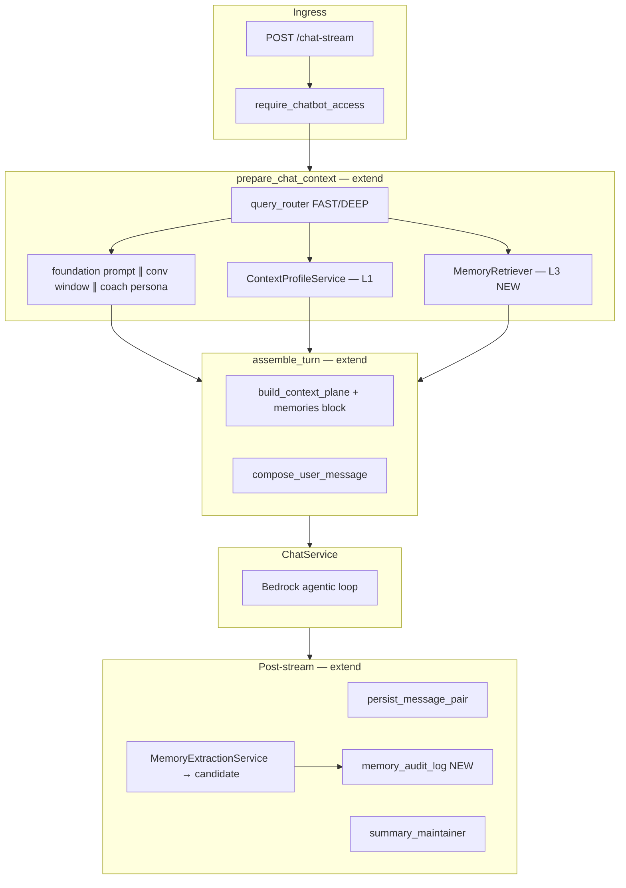

# User Memory-Based Personalization — Implementation Plan

**Foundation:** Context-plane PR on `dev` — see [`context-plane-architecture.md`](./context-plane-architecture.md)  
**Knowledge discipline:** [`memory-kind-registry.md`](./memory-kind-registry.md) + [`memory-competency-questions.md`](./memory-competency-questions.md) (required before extraction/retrieval code)  
**Next sprint (Nest + RBAC):** [`next-sprint-platform-integration-spec.md`](./next-sprint-platform-integration-spec.md) + [`jwt-role-resolution-spec.md`](./jwt-role-resolution-spec.md)  
**Status & demo:** [`memory-implementation-status.md`](./memory-implementation-status.md) + [`memory-demo-and-testing.md`](./memory-demo-and-testing.md)  
**Reference only:** [`proposals/approach-03-distilled-memories.md`](./proposals/approach-03-distilled-memories.md) (patterns, not file names)

**Audience:** Any agent or engineer implementing end-to-end. Read this document fully before writing code.

---

## 0. Authority and scope

### What wins when docs disagree

| Priority | Source                                                       | Use for                                                                                              |
| -------- | ------------------------------------------------------------ | ---------------------------------------------------------------------------------------------------- |
| **1**    | `story`                                                      | Acceptance criteria, role behavior, edge cases, audit requirements                                   |
| **2**    | Merged context-plane PR code                                 | Pipeline hooks, file layout, TTFT patterns, subscription gate                                        |
| **3**    | `memory-kind-registry.md` + `memory-competency-questions.md` | Controlled vocabulary, extraction rules, L1/L3 precedence, governance                                |
| **4**    | A3 proposal                                                  | Storage patterns (pgvector, extraction sketch, compliance ideas) — adapt names and flow to match (2) |

### In scope (this initiative)

- Cross-session **distilled memories** per user (and scoped variants for coach/manager/admin).
- **Retrieval** on the chat critical path (non-blocking degrade).
- **Extraction** after conversation turns (async, off critical path).
- **Memory API** + **Memory Panel UI** + consent.
- **Role-based retrieval and visibility** policy.
- **Memory action audit logging**.
- Integration with existing **Context Plane**, **threads**, **warm BSP tier**, **subscription auth**.
- **Knowledge discipline (v1):** kind registry, competency questions, entity normalization, candidate→confirmed pipeline, governance hooks, L1-vs-L3 BSP precedence.

### Out of scope (unless story is amended)

- Replacing the context-plane pipeline or reintroducing `RAGService`.
- Changing `backend/` Nest code (read-only for chatbot agents — surface gaps as tickets).
- Approach 4 (behavioral memory mesh / graph / reflection agent).
- Rewriting Bedrock foundation prompts.

### Non-goals inherited from context-plane PR

- Sub-1.5s TTFT on every coach + tools + RAG path.
- JWT role decoding (still `request.user_type` from payload — document and work within it until auth hardening lands).

---

## 1. Current baseline (what already exists)

Read these files first. **Do not duplicate or replace them.**

### 1.1 Chat pipeline (single path)

```
POST /chat | /chat-rag | /chat-unified | /chat-stream
  → require_chatbot_access()          # chatbot/src/app/api/routes/chat_helpers.py
  → UnifiedChatService                # unified_chat_service.py
  → prepare_chat_context()            # chat_preparation.py
  → assemble_turn()                   # turn_assembly.py → build_context_plane()
  → ChatService agentic loop          # chat_service.py
  → [post-stream] persist + summary   # thread_service + summary_maintainer
```

| Module        | Path                                      | Role                                       |
| ------------- | ----------------------------------------- | ------------------------------------------ |
| Context plane | `app/domain/context_plane.py`             | Tier S (cached static) + dynamic blocks    |
| Preparation   | `app/services/chat_preparation.py`        | Parallel I/O, FAST/DEEP routing            |
| Warm tier     | `app/services/context_profile_service.py` | Live BSP + peer mentions (Nest HTTP)       |
| Router        | `app/observability/query_router.py`       | FAST vs DEEP                               |
| Strategy      | `app/observability/context_strategy.py`   | none / user_message_prefix / system_append |
| Telemetry     | `app/observability/pipeline_telemetry.py` | Step timing, TTFT                          |

### 1.2 Thread persistence (A1 — done)

| Item     | Location                                                                      |
| -------- | ----------------------------------------------------------------------------- |
| Schema   | `src/lambdas/db_init/migrations/003_thread_persistence.sql`, `004_*`, `005_*` |
| Services | `thread_service.py`, `conversation_window.py`, `summary_maintainer.py`        |
| API      | `app/api/routes/threads.py`                                                   |
| Frontend | `ChatbotSidebar`, `chatbot-threads.api.ts`, `chatbot.store.ts`                |

Window sizes today: `quick` = 6 messages (3 turns), `deep_dive` = 12 messages (6 turns). **Keep these** unless product explicitly adopts A3’s 0-turn quick.

### 1.3 Live personalization (not durable memory)

| Source         | Endpoint                                           | Service                      |
| -------------- | -------------------------------------------------- | ---------------------------- |
| User BSP       | `GET /users/me/chatbot/personalization-context`    | `BspContextInjector`         |
| Peer @mentions | `POST /users/me/peer-mentions/resolve`             | `PeerMentionContextInjector` |
| Coach coachee  | **Mock** in `backend_client.get_client_snapshot()` | `BspContextInjector`         |

### 1.4 What does not exist yet

- `memories` table, repositories, retriever, extraction worker
- `/memories`, `/consent`, `/privacy/*` routes
- `ChatbotMemoryPanel.tsx`
- Memory citations on responses
- Memory-specific audit events
- Per-user DEK / crypto-shred (shared CMK today — upgrade path documented in `crypto.py`)

---

## 2. Target architecture (story + PR)

### 2.1 Three context layers (mental model)

| Layer                     | Name        | Scope                                | Technology today                    | After memory story    |
| ------------------------- | ----------- | ------------------------------------ | ----------------------------------- | --------------------- |
| **L1 — Live profile**     | Warm tier   | Current session / 15 min cache       | Nest HTTP → `ContextProfileService` | Unchanged             |
| **L2 — Thread context**   | Hot tier    | Single thread                        | RDS messages + rolling summary      | Unchanged             |
| **L3 — Distilled memory** | Memory tier | **Cross-thread**, per user (+ scope) | **New**                             | pgvector + extraction |

Story AC “retrieves relevant memory during future conversations” = **L3**. L1/L2 alone do not satisfy the story.

### 2.2 Updated flow diagram



### 2.3 Design rules (mandatory)

1. **Extend, don’t fork** — Add memory to `PreparedChatContext`, `build_context_plane()`, `prepare_chat_context()`. Do not create a parallel `ContextAssembler` that bypasses the context plane.
2. **Degrade always** — Memory retrieval/extraction failures never block chat (story AC). Mirror warm-tier degrade patterns in `BspContextInjector`.
3. **Encrypt at rest** — Memory content stored ciphertext (reuse `CryptoClient`; upgrade to per-user DEK in Phase 2 if scheduled).
4. **Scope by identity** — Primary key for retrieval: `user_id_hash` (SHA-256 of Cognito sub, same as threads).
5. **RBAC on read** — Filter memories at retrieval time by role, consent, sensitivity, and optional scope (coachee, company, corporation).
6. **Audit mutations** — Create, update, delete, supersede, extract → audit row (separate from chat interaction audit).
7. **Idempotent extraction** — One extraction job per `(user_id_hash, assistant_message_id)` to handle concurrent sessions.
8. **No `backend/` edits** — Chatbot agents integrate via existing/new Nest contracts only.
9. **Registry before runtime** — Never accept a `kind` or `bsp_dimension` not in `memory_registry.py` (mirrors [`memory-kind-registry.md`](./memory-kind-registry.md)).
10. **Candidates before prompt** — Extraction writes `status=candidate`; only `confirmed` memories enter retrieval (see §3.5).
11. **L1 beats L3 on BSP facts** — Nest BSP overrides conflicting L3 `behavioural_insight` (see [`memory-competency-questions.md`](./memory-competency-questions.md) §4).

---

## 2.4 Knowledge discipline (Ontology Pipeline alignment)

Structured knowledge practices ([Ontology Pipeline refresh](https://moderndata101.substack.com/p/the-ontology-pipeline-refresh)) applied at our maturity level:

| Practice                     | Our v1 implementation                                                         |
| ---------------------------- | ----------------------------------------------------------------------------- |
| Controlled vocabulary        | [`memory-kind-registry.md`](./memory-kind-registry.md) + `memory_registry.py` |
| Competency questions         | [`memory-competency-questions.md`](./memory-competency-questions.md)          |
| AI accelerates, humans judge | Extraction → **`candidate`** → user confirms in Memory Panel                  |
| Entity dedup / synonyms      | `entity_normalizer.py` + `entities_normalized` column                         |
| Governance as ongoing work   | §17 — owners, drift job, quarterly audit                                      |
| Progressive staging          | L3 distilled now; graph (A4) later — do not skip to ontology                  |

---

## 3. Memory taxonomy (story-aligned)

**Full definitions:** [`memory-kind-registry.md`](./memory-kind-registry.md). Summary below.

### 3.1 Memory kinds (`kind` column)

Map story categories to stored enums:

| `kind`                | Story mapping              | Typical source                              |
| --------------------- | -------------------------- | ------------------------------------------- |
| `preference`          | Preferences                | Extraction                                  |
| `goal`                | Goals                      | Extraction                                  |
| `behavioural_insight` | Behavioural insights       | Extraction + BSP tags                       |
| `coaching_history`    | Coaching context / history | Extraction (coach mode)                     |
| `fact`                | General context            | Extraction                                  |
| `relationship`        | Named people, teams        | Extraction                                  |
| `observation`         | Session observations       | Extraction (coach)                          |
| `team_insight`        | Manager team trends        | Nest aggregate **or** extraction with scope |
| `org_insight`         | Admin org analytics        | Nest aggregate **or** read-only tool        |

Use a single `TEXT` + `CHECK` constraint (same pattern as `conversations.persona`).

### 3.2 BSP dimension (`bsp_dimension` — optional)

Reuse A3 reference values where applicable:

`strengths_observed` | `stress_triggers_observed` | `growth_edges_observed` | `environmental_preferences` | `interaction_preferences` | `NULL`

### 3.3 Memory scope (`scope` — new vs A3)

Story requires role-specific visibility. Add scope columns:

| Field        | Purpose                                                     |
| ------------ | ----------------------------------------------------------- |
| `scope_type` | `personal` \| `coachee` \| `team` \| `organization`         |
| `scope_ref`  | Nullable ID (coachee user hash, company id, corporation id) |

Default: `personal` / `NULL` for employee memories. Coach memories about a coachee: `coachee` + `scope_ref`. Manager/admin: `team` or `organization` + ref when populated from Nest.

### 3.4 Sensitivity (`sensitivity` — RBAC)

| Level        | Who can retrieve                                    |
| ------------ | --------------------------------------------------- |
| `normal`     | Owner always; coach if coachee-scoped and permitted |
| `restricted` | Owner + superadmin only                             |
| `team`       | Owner + managers with company access to scope_ref   |

Enforce in `MemoryRetriever`, not only in API.

### 3.5 Memory status (candidate pipeline)

| `status`    | Written by                          | Retrieved into prompt? |
| ----------- | ----------------------------------- | ---------------------- |
| `candidate` | Haiku extraction                    | **No**                 |
| `confirmed` | User confirm, manual POST, or PATCH | **Yes**                |
| `rejected`  | User dismiss in panel               | No                     |
| (implicit)  | `superseded_by IS NOT NULL`         | No                     |

**API:**

- `POST /memories/{id}/confirm` → `status=confirmed`, audit `confirm`
- `POST /memories/{id}/reject` → `status=rejected`, audit `reject`

Manual `POST /memories` creates `confirmed` immediately (user explicitly asked to remember).

### 3.6 Entity normalization

| Column                | Purpose                                         |
| --------------------- | ----------------------------------------------- |
| `entities`            | Display strings (original casing)               |
| `entities_normalized` | Lowercase, trimmed keys for GIN match and dedup |

Shared logic: `app/services/memory/entity_normalizer.py` — used on extract, retrieve, and contradiction detection.

---

## 4. Role × personalization policy

Map story roles to chatbot `user_type` / persona values:

| Story role | Chatbot `user_type`                                                      | L1 warm tier                 | L3 memory retrieve                             | L3 memory extract                        | Notes                                                      |
| ---------- | ------------------------------------------------------------------------ | ---------------------------- | ---------------------------------------------- | ---------------------------------------- | ---------------------------------------------------------- |
| Employee   | `employee`                                                               | BSP personalization          | top **5**, all personal kinds                  | Yes on `deep_dive`                       | Goals + behavioural in extract prompt                      |
| Coach      | `coach`                                                                  | Coachee snapshot (mock→real) | top **8**, incl. coaching_history, observation | Yes on `deep_dive`; tag coachee in scope | Requires real `get_client_snapshot` for full AC            |
| Manager    | TBD — likely company admin persona or `employee` with elevated Nest role | Team rollup API (Nest)       | top **5** team_insight + personal              | Limited — prefer Nest-sourced team facts | **Clarify with product**; may ship as live API block first |
| Admin      | `superadmin`                                                             | Org analytics API (Nest)     | top **5** org_insight + personal               | No auto-extract org facts from chat      | Prefer read-only org tools over extraction                 |
| Default    | `default`                                                                | Same as employee             | top **3**                                      | Same as employee                         |                                                            |

### Mode × memory policy (updated from A3)

| Policy                    | `quick`                                                  | `deep_dive`            | FAST path (router)                                                   |
| ------------------------- | -------------------------------------------------------- | ---------------------- | -------------------------------------------------------------------- |
| Memory retrieve           | top **2**, `preference` + `interaction_preferences` only | Full role policy above | top **2** or **skip** (prefer skip to protect TTFT — product choice) |
| Memory extract after turn | **No**                                                   | **Yes** (if consent)   | **No**                                                               |
| Thread window             | 3 turns (existing)                                       | 6 turns (existing)     | 3 turns                                                              |
| Rolling summary           | Yes (existing)                                           | Yes (existing)         | Yes                                                                  |

Document chosen FAST behavior in `memory_policy.py` constants.

---

## 5. Data model

### 5.1 Migration

**File:** `chatbot/src/lambdas/db_init/migrations/006_user_memories.sql`

Do **not** replace `003_thread_persistence.sql`. Additive only.

```sql
-- Core memories table
CREATE TABLE IF NOT EXISTS memories (
    id                       UUID PRIMARY KEY DEFAULT gen_random_uuid(),
    user_id_hash             TEXT NOT NULL,
    kind                     TEXT NOT NULL,
    bsp_dimension            TEXT NULL,
    scope_type               TEXT NOT NULL DEFAULT 'personal',
    scope_ref                TEXT NULL,
    sensitivity              TEXT NOT NULL DEFAULT 'normal',
    content_ciphertext       BYTEA NOT NULL,
    embedding                vector(1024) NOT NULL,
    entities                 JSONB NOT NULL DEFAULT '[]'::jsonb,
    entities_normalized      JSONB NOT NULL DEFAULT '[]'::jsonb,
    importance               REAL NOT NULL DEFAULT 0.5,
    status                   TEXT NOT NULL DEFAULT 'candidate',
    source_message_id        UUID NULL REFERENCES messages(id) ON DELETE SET NULL,
    source_conversation_id   UUID NULL REFERENCES conversations(id) ON DELETE SET NULL,
    superseded_by            UUID NULL REFERENCES memories(id),
    extraction_idempotency_key TEXT NULL UNIQUE,
    user_edited              BOOLEAN NOT NULL DEFAULT false,
    soft_deleted_at          TIMESTAMPTZ NULL,
    created_at               TIMESTAMPTZ NOT NULL DEFAULT now(),
    last_accessed_at         TIMESTAMPTZ NULL,
    last_retrieved_at        TIMESTAMPTZ NULL,

    CONSTRAINT memories_valid_kind CHECK (kind IN (
        'preference', 'goal', 'behavioural_insight', 'coaching_history',
        'fact', 'relationship', 'observation', 'team_insight', 'org_insight'
    )),
    CONSTRAINT memories_valid_scope CHECK (scope_type IN (
        'personal', 'coachee', 'team', 'organization'
    )),
    CONSTRAINT memories_valid_sensitivity CHECK (sensitivity IN (
        'normal', 'restricted', 'team'
    )),
    CONSTRAINT memories_valid_status CHECK (status IN (
        'candidate', 'confirmed', 'rejected'
    ))
);

CREATE INDEX IF NOT EXISTS memories_embedding_hnsw
    ON memories USING hnsw (embedding vector_cosine_ops);
CREATE INDEX IF NOT EXISTS memories_user_active
    ON memories (user_id_hash, kind)
    WHERE soft_deleted_at IS NULL
      AND superseded_by IS NULL
      AND status = 'confirmed';
CREATE INDEX IF NOT EXISTS memories_entities_gin
    ON memories USING gin (entities_normalized);
CREATE INDEX IF NOT EXISTS memories_scope
    ON memories (user_id_hash, scope_type, scope_ref) WHERE soft_deleted_at IS NULL;

-- Consent (required for extraction)
CREATE TABLE IF NOT EXISTS memory_consent (
    user_id_hash   TEXT PRIMARY KEY,
    granted        BOOLEAN NOT NULL DEFAULT false,
    scope          TEXT NOT NULL DEFAULT 'memory_extraction',
    source         TEXT NOT NULL DEFAULT 'ui',
    granted_at     TIMESTAMPTZ NULL,
    revoked_at     TIMESTAMPTZ NULL,
    updated_at     TIMESTAMPTZ NOT NULL DEFAULT now()
);

-- Memory audit (story AC: memory actions audit logged)
CREATE TABLE IF NOT EXISTS memory_audit_log (
    id             UUID PRIMARY KEY DEFAULT gen_random_uuid(),
    user_id_hash   TEXT NOT NULL,
    actor_role     TEXT NOT NULL,
    action         TEXT NOT NULL,  -- create|update|delete|supersede|retrieve|extract
    memory_id      UUID NULL,
    metadata       JSONB NOT NULL DEFAULT '{}'::jsonb,
    created_at     TIMESTAMPTZ NOT NULL DEFAULT now()
);

CREATE INDEX IF NOT EXISTS memory_audit_user_time
    ON memory_audit_log (user_id_hash, created_at DESC);
```

**Phase 2 optional (compliance hardening):** `users_kms`, `erasure_requests` per A3 reference — schedule after MVP if legal accepts shared CMK + soft delete initially.

### 5.2 Pydantic / API types

**File:** `chatbot/src/app/models/schema.py` — add:

- `MemoryKind`, `MemoryScopeType`, `MemorySensitivity`, `MemoryStatus`
- `MemoryRecord`, `MemoryCitationRef`, `MemoryListResponse`
- Extend `ChatResponse` / stream done payload with optional `memory_citations: list[MemoryCitationRef]`

**Frontend mirror:** `frontend/src/types/chatbot/chatbot-memory.types.ts` (new).

---

## 6. Backend (chatbot) — module plan

### 6.1 New packages

```
chatbot/src/app/
├── domain/
│   ├── memory_registry.py         # Constants mirroring memory-kind-registry.md
│   └── memory_prompts.py          # Extraction system prompt + XML format for plane
├── repositories/
│   ├── memory_repository.py       # CRUD, supersede, soft delete, hybrid search
│   └── memory_consent_repository.py
├── services/memory/
│   ├── __init__.py
│   ├── memory_policy.py           # Role × mode × path + L1/L3 precedence helpers
│   ├── entity_normalizer.py       # Normalize entities on write/read
│   ├── retriever.py               # Semantic + entity + RRF fusion (confirmed only)
│   ├── extraction_service.py      # Haiku JSON → candidate rows
│   ├── embedding_service.py       # Titan v2 wrapper
│   ├── governance.py              # Drift hooks, review sampling (Phase 7)
│   └── audit.py                   # write_memory_audit_log()
├── api/routes/
│   ├── memories.py
│   └── memory_consent.py
```

### 6.2 Extend existing modules

| File                            | Change                                                                                                                                 |
| ------------------------------- | -------------------------------------------------------------------------------------------------------------------------------------- |
| `chat_preparation.py`           | Add `memory_task` to parallel gather; populate `PreparedChatContext.memories_block`, `memory_citations`, `memories_retrieval_degraded` |
| `PreparedChatContext` dataclass | New fields above                                                                                                                       |
| `context_plane.py`              | Add optional `extracted_memories_block: str` to dynamic tier; helper `format_memories_xml()`                                           |
| `turn_assembly.py`              | Pass memory block into `build_context_plane()`                                                                                         |
| `unified_chat_service.py`       | After `DoneEvent` + persist: schedule `MemoryExtractionService.extract_if_eligible()`; record citations in `interaction_meta`          |
| `dependencies.py`               | Wire `MemoryRetriever`, `MemoryExtractionService`, repos                                                                               |
| `main.py`                       | Register `memories`, `memory_consent` routers                                                                                          |
| `config.py`                     | `ENABLE_MEMORY_EXTRACTION`, `ENABLE_MEMORY_RETRIEVAL`, `MEMORY_RETRIEVE_TIMEOUT_MS`, embedding model id                                |
| `content_guardrail.py`          | Block patterns for extraction output (medical, protected class)                                                                        |
| `pipeline_telemetry.py`         | Steps: `memory_retrieve`, `memory_extract`; fields: `memories_retrieved_count`, `memory_degraded`, `memory_candidates_created`         |

### 6.3 MemoryRetriever algorithm

Reference A3 hybrid retrieval; implement in `retriever.py`:

1. **Embed query** — current user message (or message + thread title) via Titan v2, 1024-dim.
2. **Semantic pass** — pgvector cosine, filter: `user_id_hash`, `status = 'confirmed'`, `soft_deleted_at IS NULL`, `superseded_by IS NULL`, RBAC scope.
3. **Entity pass** — normalize tokens from message via `entity_normalizer`; GIN match on `entities_normalized`.
4. **RRF fusion** — `score = sum(1 / (k + rank))`, k=60.
5. **Policy filter** — apply `memory_policy.py` top-k and kind filter by role/mode/path.
6. **L1/L3 precedence** — attach instruction in XML that Nest BSP block overrides conflicting assessment facts (see competency doc §4).
7. **Decrypt batch** — `CryptoClient.decrypt` for top-k rows; on failure skip row, log, continue.
8. **Return** — `(xml_block, citations[], degraded: bool)`.

Timeout: default **250 ms** on critical path; on timeout return empty block, `degraded=true`.

### 6.4 MemoryExtractionService

Runs **after** stream `DoneEvent` (same lifecycle as `summary_maintainer.refresh_if_needed`):

**Eligibility:**

- `chat_mode == deep_dive`
- Consent `memory_consent.granted == true`
- `ENABLE_MEMORY_EXTRACTION == true`
- Not FAST path
- Valid `assistant_message_id` from persist step

**Steps:**

1. Load turn (user message + assistant response) from thread or in-memory capture.
2. Load top 10 **confirmed** memory summaries for dedup context (decrypted, truncated).
3. Call Haiku with JSON schema + embedded [`memory-kind-registry.md`](./memory-kind-registry.md) rules (see §6.5).
4. For each candidate: validate `kind` / `bsp_dimension` via `memory_registry.py`; reject prohibited categories (competency doc §3).
5. Normalize `entities` → `entities_normalized` via `entity_normalizer.py`.
6. Check idempotency key `{user_id_hash}:{assistant_message_id}:{index}`; skip duplicates.
7. Detect contradiction via normalized entity overlap + same `kind` → set `superseded_by` on old **confirmed** row.
8. If new row duplicates L1 BSP themes, skip or write at low importance and do not auto-confirm.
9. Embed + encrypt + insert with `status='candidate'`; write `memory_audit_log` action=`create`.
10. On failure: log + audit action=`extract` status=error; **never** raise to client.

Coach mode: pass `client_id` / coachee scope into extraction prompt and `scope_type=coachee`.

### 6.5 Extraction prompt (constant)

Store in `domain/memory_prompts.py`. Load kind definitions from `memory_registry.py` (not free-form). Key rules:

- Output strict JSON `{ "memories": [ ... ] }`, 0–3 items.
- Third-person statements about the user.
- Skip chit-chat; skip clinical/protected-class inference (competency doc §3).
- Only **new** facts vs `<existing_memories>` and vs L1 BSP summary when provided.
- Map to `kind` + optional `bsp_dimension` — **must pass registry validators**.
- Set `importance` 0.0–1.0; discard below 0.3.
- Output is **candidate** — not ground truth until user confirms.

Use Haiku model already configured (`bedrock_summary_model` or dedicated env var).

### 6.6 API routes

**Subscription:** All routes call `require_chatbot_subscription()` (same as threads).

| Method | Path                     | Purpose                                                 |
| ------ | ------------------------ | ------------------------------------------------------- |
| GET    | `/memories`              | List memories (`?status=candidate` for pending section) |
| POST   | `/memories`              | Manual “remember this” → `status=confirmed`             |
| PATCH  | `/memories/{id}`         | User correction (`user_edited=true`)                    |
| POST   | `/memories/{id}/confirm` | Promote candidate → confirmed                           |
| POST   | `/memories/{id}/reject`  | Dismiss candidate                                       |
| DELETE | `/memories/{id}`         | Soft delete                                             |
| GET    | `/memories/consent`      | Current consent                                         |
| POST   | `/memories/consent`      | Grant/revoke extraction consent                         |

**Phase 2:** `POST /privacy/erasure`, `GET /privacy/export` (A3 reference).

List response must **not** include other users’ coachee memories unless RBAC permits.

### 6.7 Chat response citations

Add to `interaction_meta` during retrieve:

```python
interaction_meta["memory_citations"] = [{"id": "...", "kind": "preference", "snippet": "..."}]
```

Include in:

- Non-stream `ChatResponse.memory_citations`
- Stream: optional `MemoryCitationEvent` in SSE **or** include in final `DoneEvent` payload (extend `DoneEvent` dataclass in `utils/sse.py`).

Frontend: optional chip “Referenced N memories” on assistant bubble.

---

## 7. Nest backend dependencies (read-only — ticket Nest team)

Chatbot cannot fully satisfy story coach/manager/admin ACs without these:

| Endpoint (proposed)                             | Story AC                | Status today       |
| ----------------------------------------------- | ----------------------- | ------------------ |
| `GET /users/me/chatbot/personalization-context` | Employee BSP            | ✅ Live            |
| `POST /users/me/peer-mentions/resolve`          | Peer context            | ✅ Live            |
| `GET /users/me/subscription-access`             | Gate                    | ✅ Live            |
| `GET /coach/clients/{id}/chatbot-context`       | Coach coachee + history | ❌ Mock in chatbot |
| `GET /users/me/chatbot/team-insights`           | Manager team trends     | ❌ Missing         |
| `GET /users/me/chatbot/org-insights`            | Admin org analytics     | ❌ Missing         |

**MVP strategy:**

- Ship employee personal memories **without** blocking on Nest.
- Coach: extraction scoped to coachee when `client_id` present; live coachee block when API lands.
- Manager/admin: inject **live** Nest blocks on DEEP path via `ContextProfileService` extension (same warm tier pattern) — do not wait for extraction for team/org facts.

---

## 8. Frontend implementation

Follow `frontend_rules_to_be_followed.mdc`: types in `types/`, const in `const/`, barrel imports, Tailwind + tokens only.

### 8.1 New files

| File                                                            | Purpose                              |
| --------------------------------------------------------------- | ------------------------------------ |
| `frontend/src/types/chatbot/chatbot-memory.types.ts`            | `ChatbotMemory`, kinds, consent      |
| `frontend/src/const/chatbot/chatbot-memory.const.ts`            | Panel copy, consent strings          |
| `frontend/src/api/chatbot-memories.api.ts`                      | list, create, patch, delete, consent |
| `frontend/src/components/chatbot/ChatbotMemoryPanel.tsx`        | List, delete, edit, consent toggle   |
| `frontend/src/components/chatbot/ChatbotMemoryCitationChip.tsx` | Optional transparency chip           |
| `frontend/src/test/chatbot/chatbot-memories.*.test.ts`          | API + store tests                    |

### 8.2 Extend existing

| File                                 | Change                                                 |
| ------------------------------------ | ------------------------------------------------------ |
| `chatbot.store.ts`                   | `memoriesSlice`: load, optimistic delete/edit, consent |
| `ChatbotTopBar.tsx`                  | Entry to Memory Panel (icon + aria-label)              |
| `ChatbotPage.tsx`                    | Panel drawer/modal composition                         |
| `types/chatbot/chatbot-sse.types.ts` | Citation fields on done event                          |
| `components/chatbot/index.ts`        | Barrel exports                                         |

### 8.3 UX requirements (story + knowledge discipline)

- Consent toggle at top of panel — default **off** until user opts in (competency doc §8).
- **Pending confirmation** section for `status=candidate` rows — Confirm / Reject buttons.
- **Confirmed** section: kind label, content, created date, source thread link, delete, edit.
- Badge for `user_edited` memories.
- Empty state when no memories.
- Loading/error states; retrieval failures invisible to user during chat.
- Optional: notification badge on top bar when pending candidates exist.

---

## 9. Infrastructure & config

### 9.1 CDK / env vars

Add to `chatbot/infrastructure/modules/lambdas/runtime_stack.py` and `environments/*.yaml`:

| Variable                     | Example     | Purpose                   |
| ---------------------------- | ----------- | ------------------------- |
| `ENABLE_MEMORY_RETRIEVAL`    | `true`      | Feature flag              |
| `ENABLE_MEMORY_EXTRACTION`   | `true`      | Feature flag              |
| `MEMORY_RETRIEVE_TIMEOUT_MS` | `250`       | Critical path budget      |
| `MEMORY_EXTRACT_MODEL_ID`    | Haiku id    | Extraction LLM            |
| `MEMORY_EMBEDDING_MODEL_ID`  | Titan v2    | Same dim as pgvector 1024 |
| `MEMORY_DEFAULT_STATUS`      | `candidate` | Extraction write status   |
| `MEMORY_IMPORTANCE_MIN`      | `0.3`       | Discard below threshold   |

### 9.2 IAM

- Bedrock invoke for Haiku + Titan (likely already present).
- KMS encrypt/decrypt (existing messages CMK).

### 9.3 Observability

CloudWatch dashboard (`pipeline_observability_stack.py`) — add metric filters:

- `memories.retrieved_count`
- `memory_retrieve.degraded`
- `memory_extract.created_count`
- `memory_extract.errors`

---

## 10. Edge cases (story §) — required behavior

| Edge case                                        | Implementation                                                                                                                                                                               |
| ------------------------------------------------ | -------------------------------------------------------------------------------------------------------------------------------------------------------------------------------------------- |
| Duplicate/conflicting memories                   | Idempotency key; extraction dedup prompt; `superseded_by` on contradiction; user edit/delete in panel                                                                                        |
| User role changes                                | Store `actor_role` on audit; retrieval filters by **current** role from `extract_auth_context`; optional nightly job to mark `team` memories stale when company access revoked (**Phase 2**) |
| Outdated memory                                  | User PATCH in panel; extraction sets `superseded_by`; show `user_edited` badge in UI                                                                                                         |
| Sensitive memory to wrong role                   | `sensitivity` column + retriever RBAC; never return coachee memories to unrelated employees                                                                                                  |
| Memory service unavailable                       | Retriever timeout → empty block, log degraded, chat continues                                                                                                                                |
| Concurrent sessions                              | Unique `extraction_idempotency_key`; DB unique constraint                                                                                                                                    |
| Ambiguous/inaccurate extraction                  | Low importance threshold (<0.3 discard); max 3 per turn; **candidate** status until confirm; visible panel                                                                                   |
| False BSP duplication                            | Skip extract when fact matches L1; supersede conflicting L3 on detect                                                                                                                        |
| Synonym duplicates ("Priya" / "my report priya") | `entities_normalized` + overlap on insert                                                                                                                                                    |

---

## 11. Testing requirements

Mirror `chatbot/src/tests/units/` structure. **Required before merge:**

| Test file                         | Covers                                                              |
| --------------------------------- | ------------------------------------------------------------------- |
| `test_memory_repository.py`       | CRUD, supersede, soft delete, search, status filters                |
| `test_memory_retriever.py`        | RRF, policy filters, timeout degrade, RBAC, confirmed-only          |
| `test_memory_extraction.py`       | JSON parse, idempotency, contradiction, guardrail, candidate status |
| `test_memory_registry.py`         | Kind/dimension validation                                           |
| `test_entity_normalizer.py`       | Normalization rules §3.6                                            |
| `test_memory_policy.py`           | Role × mode matrix, L1/L3 precedence hints                          |
| `test_memory_routes.py`           | API auth, subscription gate, consent, confirm/reject                |
| `test_chat_preparation_memory.py` | Parallel retrieve wired, degraded flag                              |
| `test_context_plane_memory.py`    | XML block in dynamic tier                                           |
| `test_memory_audit.py`            | Audit rows on CRUD/extract/confirm/reject                           |
| `tests/fixtures/memory_golden/`   | Competency harness cases (competency doc §7)                        |

Frontend:

- `chatbot-memories.api.test.ts`
- Store tests for optimistic update

Integration smoke (manual QA checklist in §13).

---

## 12. Phased delivery plan

Each phase has **Definition of Done**. Do not start phase N+1 until DoD met.

### Phase 0 — Decisions & scaffolding (1–2 days)

**Tasks:**

- [ ] Product confirm: manager persona mapping (`employee` + Nest role vs new persona).
- [ ] Confirm FAST path memory policy (skip vs top-2).
- [ ] Confirm consent default (**off** globally — competency doc §8).
- [ ] Confirm candidate pipeline (**candidate until user confirms** — registry §3).
- [ ] Add feature flags to `config.py` (default false in prod until Phase 5).

**DoD:** Written decisions in PR description; flags exist; no user-visible behavior change.

---

### Phase 0.5 — Knowledge discipline docs & code stubs (1–2 days)

**Tasks:**

- [ ] Finalize [`memory-kind-registry.md`](./memory-kind-registry.md) (product sign-off on kinds).
- [ ] Finalize [`memory-competency-questions.md`](./memory-competency-questions.md).
- [ ] Implement `app/domain/memory_registry.py` mirroring registry (validators only — no DB yet).
- [ ] Implement `app/services/memory/entity_normalizer.py` + unit tests.
- [ ] Stub `memory_policy.py` with L1/L3 precedence constants from competency doc §4.
- [ ] Add registry + competency links to agent checklist (§14).

**DoD:** `test_memory_registry.py` + `test_entity_normalizer.py` pass; validators reject unknown kinds.

---

### Phase 1 — Schema & repository (3–4 days)

**Tasks:**

- [ ] Write `006_user_memories.sql` (includes `status`, `entities_normalized`).
- [ ] Run migration on dev RDS via db_init Lambda.
- [ ] Implement `memory_repository.py`, `memory_consent_repository.py`.
- [ ] Implement `embedding_service.py` (Titan embed).
- [ ] Repository uses `memory_registry` validators on every write.
- [ ] Unit tests for repository + embed mock.

**DoD:** Can insert/search/delete memories in tests; migration applies cleanly; invalid kind rejected.

---

### Phase 2 — Retrieval on critical path (4–5 days)

**Tasks:**

- [ ] Implement `MemoryRetriever` with RRF + RBAC.
- [ ] Extend `PreparedChatContext` + `prepare_chat_context()` parallel task.
- [ ] Add `format_memories_xml()` + wire `build_context_plane()`.
- [ ] Populate `interaction_meta["memory_citations"]`.
- [ ] Telemetry steps + degrade on timeout.
- [ ] Tests from §11.

**DoD:** `deep_dive` chat includes memory block when **confirmed** rows exist; candidates excluded; failure does not break chat.

---

### Phase 3 — Extraction off critical path (3–4 days)

**Tasks:**

- [ ] Implement `MemoryExtractionService` + `memory_prompts.py` (registry-driven).
- [ ] Hook after `DoneEvent` in `unified_chat_service.py` (stream + non-stream).
- [ ] Write **`candidate`** rows only; idempotency + supersede + entity normalization.
- [ ] Guardrail on extraction output (competency doc §3).
- [ ] `memory_audit_log` on create/supersede/extract error.
- [ ] Tests including candidate-not-retrieved assertion.

**DoD:** After `deep_dive` turn with consent, **candidate** rows appear in DB; not in prompt until confirmed; quick mode does not extract.

---

### Phase 4 — Memory API (2–3 days)

**Tasks:**

- [ ] `memories.py` + `memory_consent.py` routes including **confirm/reject**.
- [ ] Register in `main.py`; subscription gate.
- [ ] Audit on all mutations (create, confirm, reject, update, delete).
- [ ] OpenAPI-aligned Pydantic models.
- [ ] Route tests.

**DoD:** API can list candidates, confirm/reject, CRUD confirmed memories; consent gates extraction.

---

### Phase 5 — Frontend Memory Panel (next sprint)

**Deferred from current branch.** Backend `/memories` API ships without UI. Demo via API: [`memory-demo-and-testing.md`](./memory-demo-and-testing.md).

**Tasks:**

- [ ] Types, const, API client (incl. confirm/reject).
- [ ] Store slice with pending + confirmed sections.
- [ ] `ChatbotMemoryPanel` + top bar entry + pending badge.
- [ ] Consent toggle wired to API.
- [ ] Optional citation chip (confirmed memories only).
- [ ] Frontend tests.

See also [`next-sprint-platform-integration-spec.md`](./next-sprint-platform-integration-spec.md#part-g--frontend-memory-panel-next-sprint).

**DoD:** User can confirm/reject candidates, edit/delete confirmed memories, toggle consent; matches story transparency AC.

---

### Phase 6 — Role depth & Nest integration (parallel / 1–2 weeks)

**Tasks:**

- [ ] File Nest tickets for coach/team/org endpoints (§7).
- [ ] Extend `ContextProfileService` for team/org live blocks when APIs exist.
- [ ] Coach extraction `scope_type=coachee`.
- [ ] Replace mock `get_client_snapshot` when Nest ships.

**DoD:** Story role rows satisfied or explicitly deferred with product sign-off.

---

### Phase 7 — Governance & compliance hardening (1–2 weeks)

**Tasks:**

- [ ] Per-user DEK (`users_kms`) + CDK KMS module (optional if legal requires).
- [ ] `/privacy/erasure`, `/privacy/export`.
- [ ] DPIA doc `chatbot/docs/compliance/memory-dpia.md`.
- [ ] `test_crypto_shred.py` (if DEK shipped).
- [ ] **Governance operationalization (§17):**
  - [ ] Nightly `memory_drift_job` — role/company access revocation → mark team/org memories stale.
  - [ ] Quarterly sample audit (100 rows / LLM-judge) — competency doc §7.
  - [ ] CloudWatch alarm on `memory_extract.errors` rate.

**DoD:** Erasure demo (if DEK); drift job runs in dev; governance runbook in `chatbot/docs/runbooks/memory-governance.md`.

---

## 13. Manual QA checklist (pre-release)

- [ ] Employee `deep_dive`: state preference in thread A → **candidate** appears in panel → confirm → thread B references it.
- [ ] Reject candidate: never appears in chat context.
- [ ] `quick` mode: extraction does **not** run.
- [ ] Consent off: no new candidates after chat.
- [ ] Delete confirmed memory: bot stops referencing it.
- [ ] Edit memory: bot uses corrected text.
- [ ] Entity synonym: "Priya" / "priya" dedupe behaves correctly.
- [ ] BSP conflict: L1 profile preferred over conflicting L3 in coaching answer.
- [ ] Subscription denied: `/memories` returns 403.
- [ ] Retrieval timeout: chat still responds.
- [ ] Coach + `client_id`: memory scoped to coachee (when implemented).
- [ ] Audit: create/confirm/reject/delete in `memory_audit_log`.
- [ ] CloudWatch: `memory_retrieve` step in pipeline JSON logs.

---

## 14. Agent execution checklist (start here)

When picking up this work cold:

1. Read `story` (acceptance criteria).
2. Read [`memory-competency-questions.md`](./memory-competency-questions.md) (what to store / never store).
3. Read [`memory-kind-registry.md`](./memory-kind-registry.md) (controlled vocabulary).
4. Read this plan §0–§2.4 (authority + baseline + knowledge discipline).
5. Read `context-plane-architecture.md` §4–§7 (context plane tiers).
6. Trace one request: `chat.py` → `unified_chat_service.py` → `chat_preparation.py` → `turn_assembly.py`.
7. Confirm feature branch based on latest `dev` (includes context-plane PR).
8. Implement **one phase at a time**; run `cd chatbot/src && PYTHONPATH=. uv run pytest tests/units/ -q` after each phase.
9. Never modify `backend/` for chatbot work.
10. Add tests in the same session as API/repository code.
11. Any new `kind` requires registry doc + `memory_registry.py` + migration CHECK update.
12. Update this doc’s phase checkboxes in your PR if decisions change.

---

## 15. File touch list (quick reference)

### New — docs

- `chatbot/docs/memory-kind-registry.md`
- `chatbot/docs/memory-competency-questions.md`
- `chatbot/docs/runbooks/memory-governance.md` (Phase 7)

### New — backend

- `migrations/006_user_memories.sql`
- `domain/memory_registry.py`
- `domain/memory_prompts.py`
- `repositories/memory_repository.py`
- `repositories/memory_consent_repository.py`
- `services/memory/*.py` (incl. `entity_normalizer.py`, `governance.py`)
- `api/routes/memories.py`
- `api/routes/memory_consent.py`
- `tests/units/test_memory_*.py`
- `tests/units/test_entity_normalizer.py`
- `tests/fixtures/memory_golden/`
- `frontend/src/types/chatbot/chatbot-memory.types.ts`
- `frontend/src/const/chatbot/chatbot-memory.const.ts`
- `frontend/src/api/chatbot-memories.api.ts`
- `frontend/src/components/chatbot/ChatbotMemoryPanel.tsx`

### Modify

- `chat_preparation.py`, `context_plane.py`, `turn_assembly.py`
- `unified_chat_service.py`, `dependencies.py`, `main.py`, `config.py`
- `models/schema.py`, `utils/sse.py` (optional citation event)
- `pipeline_telemetry.py`, `content_guardrail.py`
- `infrastructure/modules/lambdas/runtime_stack.py`, `environments/*.yaml`
- `frontend/.../chatbot.store.ts`, `ChatbotTopBar.tsx`, `ChatbotPage.tsx`

### Do not modify

- `backend/**`
- Shared UI primitives (`DataTable`, `Dialog`, etc.) — compose in feature components only

---

## 16. Success criteria (story mapping)

| Story AC                                 | Delivered by                                           |
| ---------------------------------------- | ------------------------------------------------------ |
| Retrieves memory in future conversations | Phase 2 retrieval + Phase 5 panel verification         |
| Categorized by type                      | Registry §2 + UI labels                                |
| Depth varies by role                     | §4 policy + Phase 6 Nest blocks                        |
| Employee BSP/goals/coaching              | L1 warm + L3 kinds; L1 precedence on BSP               |
| Coach coachees/history                   | Phase 6 + coachee scope                                |
| Manager team / Admin org                 | Phase 6 Nest live blocks + scoped kinds                |
| Sensitive RBAC                           | §3.4 + retriever filters                               |
| Contextual non-repetitive replies        | L2 + L3 (confirmed) combined                           |
| No duplicate/conflicting                 | Phase 3 supersede + idempotency + entity normalization |
| Memory actions audit logged              | `memory_audit_log` incl. confirm/reject                |
| Retrieval failure non-blocking           | Phase 2 degrade                                        |

---

## 17. Memory governance (ongoing)

Governance is **not a one-time ship** — operationalize alongside Phase 7.

| Concern                     | Mechanism                                                          | Owner                |
| --------------------------- | ------------------------------------------------------------------ | -------------------- |
| **Vocabulary changes**      | Registry PR process (registry §5)                                  | Product + Eng        |
| **Who can change memories** | Owner confirm/reject; API RBAC                                     | Eng                  |
| **Drift on role change**    | Nightly `memory_drift_job` marks inaccessible scoped rows          | Eng                  |
| **Stale / wrong memories**  | User edit/delete; supersede on extract; quarterly sample audit     | Product + Compliance |
| **Audit trail**             | `memory_audit_log` — treat as change log                           | Eng                  |
| **Extraction quality**      | Golden harness + LLM-judge sample                                  | Eng                  |
| **Consent revocation**      | Stop extraction; existing confirmed rows remain until user deletes | Product              |

**Runbook:** `chatbot/docs/runbooks/memory-governance.md` — create in Phase 7 with on-call steps for extraction error spikes and drift job failures.

---

_Last updated: 2026-05-27 — integrated knowledge discipline (registry, competency questions, candidate pipeline, entity normalization, governance, L1/L3 precedence)._
